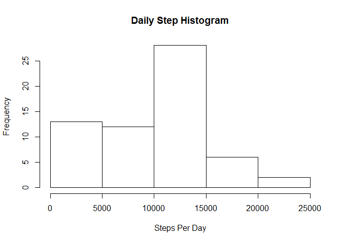
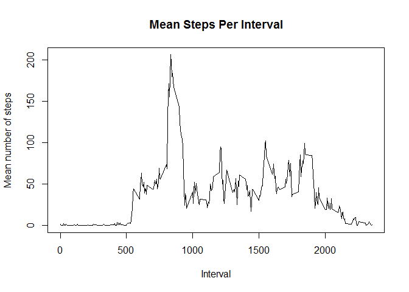
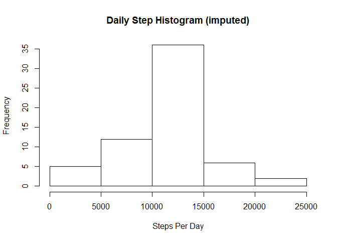

# Reproducible Research knitr document


Set global knitr options to echo = TRUE in order to make sure each chunk of r code is displayed in the final document.

```r
knitr::opts_chunk$set(echo = TRUE)
```

### Load and clean the data
      * Load dplyr and lattice
      * Load the data from the working directory
      * Convert the date column from factor to date type.

```r
library(dplyr)
library(lattice)
```

```
## Warning: package 'lattice' was built under R version 3.4.1
```

```r
data <- read.csv("activity.csv")
data$date <- as.Date(data$date)
```

### What is the mean total number of steps taken per day?
For this part of the assignment, you can ignore the missing values in the dataset.

Calculate the total number of steps taken per day

```r
      dailysteps <- data %>% group_by(date) %>% 
                        summarize(dailytotal = sum(steps, na.rm = TRUE))
```

Histogram of total steps taken per day

```r
      hist(dailysteps$dailytotal, main = "Daily Step Histogram", xlab = "Steps Per Day")
```

<!-- -->

Calculate and report the mean and median of the total number of steps taken per day

```r
#set options to prevent large numbers displaying in scientific notation
  options(scipen = 999, round = 2)
  dailymean <- dailysteps %>% 
                        summarize(dailymean = mean(dailytotal,  na.rm = TRUE))
  dailymedian <- dailysteps %>% 
                        summarize(dailymedian = median(dailytotal,  na.rm = TRUE))
      #subset the result of mean and median dplyr
        dmean <- round(dailymean[[1,1]],2)
        dmedian <- dailymedian[[1,1]]
```

The daily mean is 9354.23 steps and the daily median is 10395 steps.

### What is the average daily activity pattern?
Make a time series plot (i.e. type = "l") of the 5-minute interval (x-axis) and the average number of steps taken, averaged across all days (y-axis)

```r
#average the number of steps across each time period interval
      intervalmean <- data %>% 
                        group_by(interval) %>% 
                        summarize(periodavg = mean(steps, na.rm = TRUE))

#create time series plot
      plot(intervalmean$interval, intervalmean$periodavg, type = "l", main = "Mean Steps Per Interval", xlab = "Interval", ylab = "Mean number of steps")
```

<!-- -->

```r
#determine which interval contains on average the max number of steps
      maxrow <- intervalmean %>% 
                        filter(periodavg ==  max(periodavg)) %>% 
                        select(interval)
      maxrow <- maxrow[[1,1]]
```
Interval 835 contains on average the most steps.

### Imputing missing values
Calculate and report the total number of missing values in the dataset (i.e. the total number of rows with NAs)

```r
missingcount <- sum(is.na(data$steps))
```
There are 2304 NA values in the original data set.


Impute the missing values using the mean for that interval, create a new dataset that is equal to the original dataset but with the missing data filled in.


```r
#impute the missing step values with the mean for that particular interval
      imputedata <- transform(data, steps = ifelse(is.na(data$steps), intervalmean$periodavg[match(data$interval, intervalmean$interval)], data$steps))
```

Make a histogram of the total number of steps taken each day and Calculate and report the mean and median total number of steps taken per day.


```r
#recalculate steps per day with imputed data
      idailysteps <- imputedata %>% group_by(date) %>% 
                        summarize(idailytotal = sum(steps))

#create histogram of idailysteps
      hist(idailysteps$idailytotal, main = "Daily Step Histogram (imputed)", xlab = "Steps Per Day")
```

<!-- -->

```r
#calculate mean and median for idailysteps
  idailymean <- idailysteps %>% 
                        summarize(idailymean = mean(idailytotal))
  idailymedian <- idailysteps %>% 
                        summarize(idailymedian = median(idailytotal))
      #subset the result of mean and median
        idmean <- round(idailymean[[1,1]],2)
        idmedian <- round(idailymedian[[1,1]],2)
      dailydiff <- (idmean - dmean)
```
The imputed daily mean is 10766.19 (vs. original 9354.23) steps and the daily median is 10766.19 (vs. original 10395) steps.
Imputing the data increases the daily average by 1411.96 steps.

### Are there differences in activity patterns between weekdays and weekends?
Create a new factor variable in the dataset with two levels - "weekday" and "weekend" indicating whether a given date is a weekday or weekend day.

```r
imputedata$daytype <- ifelse(weekdays(imputedata$date) == "Saturday" | weekdays(imputedata$date) == "Sunday","weekend","weekday")
```

Make a panel plot containing a time series plot (i.e. type = "l") of the 5-minute interval (x-axis) and the average number of steps taken, averaged across all weekday days or weekend days (y-axis). See the README file in the GitHub repository to see an example of what this plot should look like using simulated data.


```r
#average the number of steps across each time period interval
      i_intervalmean <- imputedata %>% 
                        group_by(daytype, interval) %>% 
                        summarize(periodavg = mean(steps))
#make a panel plot
      xyplot(periodavg ~ interval | daytype, i_intervalmean, type = "l",layout=c(1,2), xlab = "Interval", ylab = "Number of Steps")
```

<!-- -->
